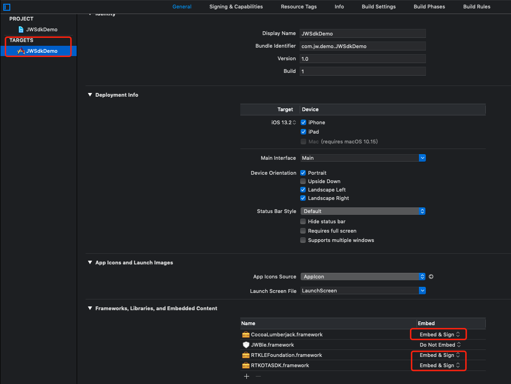

### 一、Guide package setting process

1. Import the corresponding library


2. Set Target

3. Close project ENABLE_BITCODE

   

4. Due to the high version of ios, the info description needs to be added

   ```objective-c
   NSBluetoothAlwaysUsageDescription
   ```

5. Import fmdb

### 二、Simple use process

1. Set Uid

   ```objective-c
   /**
   initialization
    
     @param uid logo id (
     Usage scenarios: 1. The A account is connected, and the B account will fail to connect again, and the A account needs to be unbound
     2. The A account is connected to the A phone. Use the B phone to log in to the A account, and you can also connect
     )
    */
   [JWBleManager.shareInstance setUpWithUid:@"programmer"];
   ```

2. Listen callback

   ```objective-c
   /**
       Connections and some basic callbacks
        Please note: JWBleDeviceConnectStatus_SyncSuccess is the standard for judging whether the real connection is successful
        */
       JWBleManager.shareInstance.connectStateChangeCallBack = ^(JWBleDeviceConnectStatus deviceConnectStatus) {
           if (deviceConnectStatus == JWBleDeviceConnectStatus_Connect) {
               NSLog(@"JWBleDeviceConnectStatus_Connect");
           } else if (deviceConnectStatus == JWBleDeviceConnectStatus_SyncSuccess) {
               if (JWBleManager.shareInstance.connectionModel == nil) {
                   return;
               }
               NSLog(@"JWBleDeviceConnectStatus_SyncSuccess");
           } else if (deviceConnectStatus == JWBleDeviceConnectStatus_SyncFailure) {
   
               NSLog(@"JWBleDeviceConnectStatus_SyncFailure");
           } else if (deviceConnectStatus == JWBleDeviceConnectStatus_DiscoverNewUpdateFirm) {
   
               NSLog(@"JWBleDeviceConnectStatus_DiscoverNewUpdateFirm");
           } else if (deviceConnectStatus == JWBleDeviceConnectStatus_DisConnect) {
               NSLog(@"JWBleDeviceConnectStatus_DisConnect");
   
           } else if (deviceConnectStatus == JWBleDeviceConnectStatus_BondFailure) {
               NSLog(@"JWBleDeviceConnectStatus_BondFailure");
   
           } else if (deviceConnectStatus == JWBleDeviceConnectStatus_BatteryUpdate) {
               NSLog(@"JWBleDeviceConnectStatus_BatteryUpdate");
   
           } else if (deviceConnectStatus == JWBleDeviceConnectStatus_ChargeStatusChanged) {
               NSLog(@"JWBleDeviceConnectStatus_ChargeStatusChanged");
           }
   
       };
   ```


### 三、Synchronized data flow

```objective-c
Synchronized data flow:
1: Connect the bracelet;
2: Execute [JWBleDataAction jwSyncDataWithCallBack:] to synchronize the bracelet data to the sdk storage;
3: After the monitoring synchronization is successful, the JWBleDataAction class provides a variety of data acquisition APIs, such as the method of acquiring steps
[JWBleDataAction jwGetStepDataByYYYYMMDDStr:@"2020-07-10" callBack:^(NSArray *dataArr) {
  if (dataArr.count == 96) {
  }
}];
```

